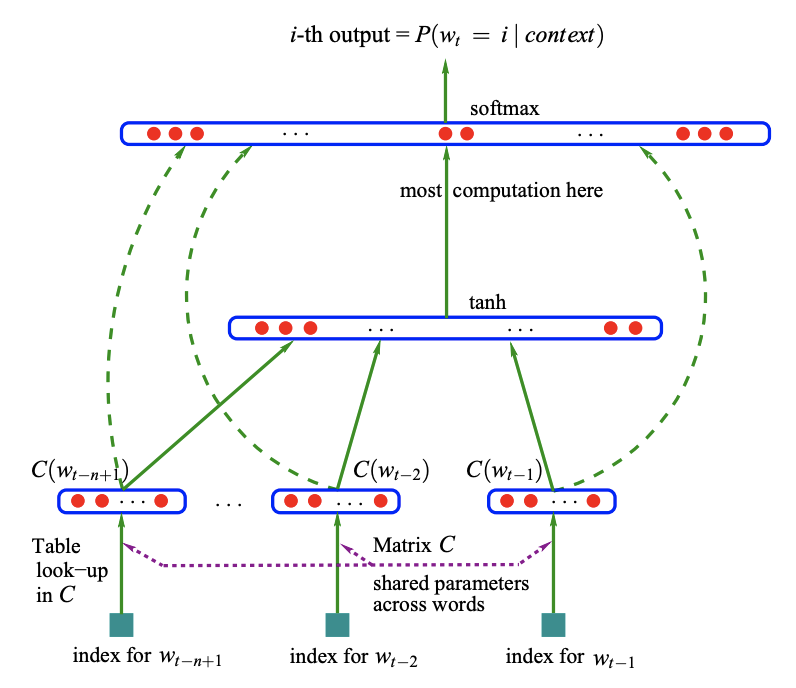

# Links

Credit: https://www.youtube.com/watch?v=TCH_1BHY58I&t=1s

# Makemore: MLP

Multilayer perceptron: https://www.jmlr.org/papers/volume3/bengio03a/bengio03a.pdf

- Propose a model of word-level model: 17,000 words vocabulary

- Each word is then associated with a vector of m features (m = 30, 60, or 100 for experiments)

- Tune these vectors using backpropagation, these vectors will move around in this space

  - Words that are similar will end up in the similar part of the space

- Why does this work?

  In the previous example, if we knew that dog and cat played similar roles (semantically and syntactically), and similarly for (the,a), (bedroom,room), (is,was), (running,walking), we could naturally generalize (i.e. transfer probability mass) from:

  - The cat is walking in the bedroom

  - To: A dog was running in a room

  Technically, our model can transfer knowledge through these similar feature vectors

---

- Input = Index of the word in vocabulary + Feature vector C of that word (C has length of m)

- The hidden layer size is **hyperparameter**, meaning we can choose whatever size and will experiment to see what is best
  
  - All of hidden neurons are fully connected to each input neuron

- Output layer has 17,000 neurons since that's our vocab size

  - Then we block out the probability of the next desired word + maximize its probability from there through adjusting the neural net parameters

- The dashed arrow presents a variation of the neural network (We don't explore it here)